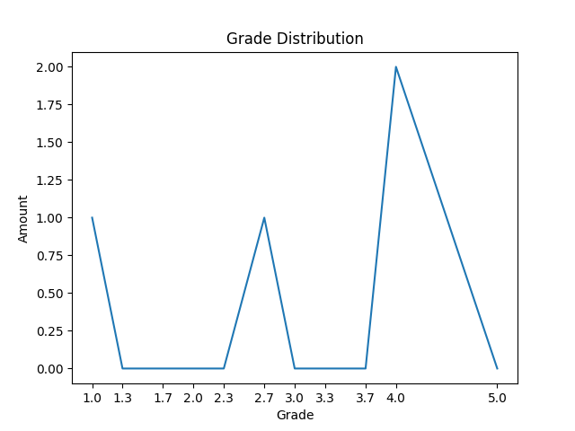
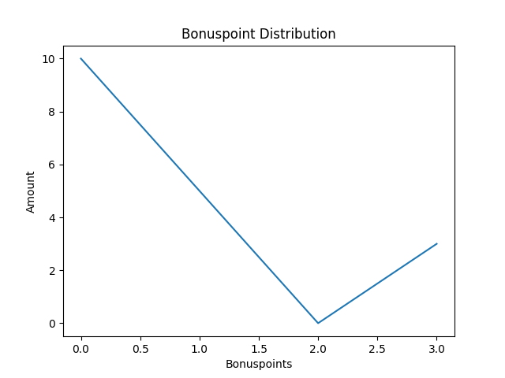
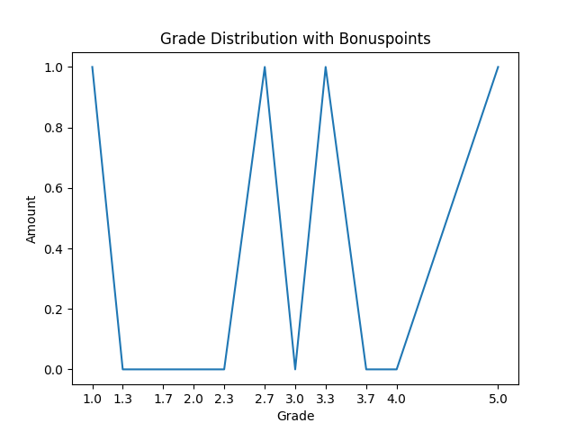

# OS23/24 Exam Grade Calculation

### Points with Grades

| Name | exercise1 | exercise2 | exercise3 | exercise4 | bonus | Points | Points w bonus | Grade | Grade w Bonus |
| ---- | ---- | ---- | ---- | ---- | ---- | ---- | ---- | ---- | ---- |
| person1 | 1 | 4.0 | 8 | 2 | 10 | 15.0 | 25.0 | 5.0 | 2.7 |
| person2 | 5 | 2.5 | 10 | 0 | 5 | 17.5 | 22.5 | 4.0 | 3.3 |
| person3 | 2 | 6.0 | 7 | 10 | 0 | 25.0 | 25.0 | 2.7 | 2.7 |
| person4 | 5 | 10.0 | 10 | 10 | 3 | 35.0 | 38.0 | 1.0 | 1.0 |

### Averages

| Exercise | Average Points | Average Percentage |
| ---- | ---- | ---- |
| exercise1 | 3.25 | 65.0% |
| exercise2 | 5.625 | 56.25% |
| exercise3 | 8.75 | 87.5% |
| exercise4 | 5.5 | 55.00000000000001% |
| bonus | 4.5 | 45.0% |
| Total | 23.125 | 66.07142857142857% |

### Point Border

| Grade | Points | Amount | Percentage |
| ---- | ---- | ---- | ---- |
| 5.0 | 0 | 1 | 25.0% |
| 4.0 | 17.5 | 1 | 25.0% |
| 3.7 | 19.25 | 0 | 0.0% |
| 3.3 | 21.0 | 0 | 0.0% |
| 3.0 | 22.75 | 0 | 0.0% |
| 2.7 | 24.5 | 1 | 25.0% |
| 2.3 | 26.25 | 0 | 0.0% |
| 2.0 | 28.0 | 0 | 0.0% |
| 1.7 | 29.75 | 0 | 0.0% |
| 1.3 | 31.5 | 0 | 0.0% |
| 1.0 | 33.25 | 1 | 25.0% |

### Grade Distribution

### Bonuspoint Distribution

### Grade Distribution with Bonuspoints

